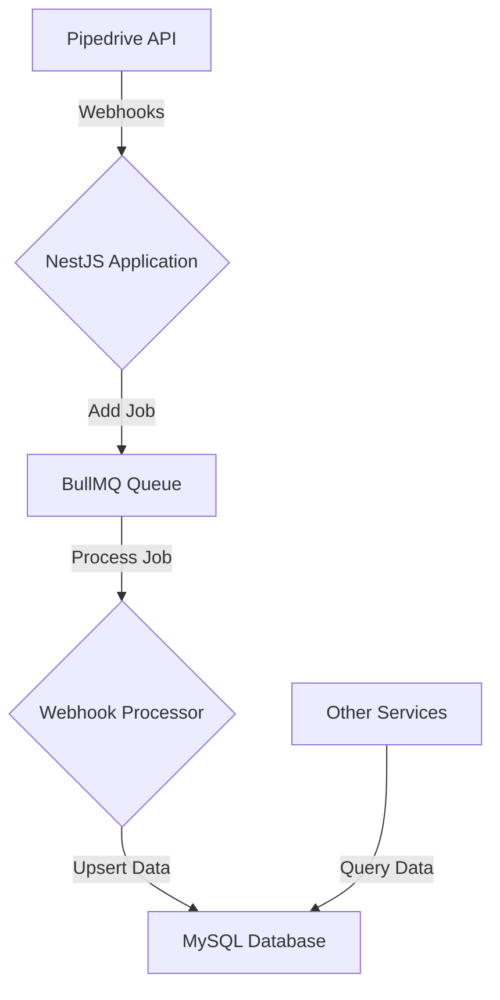

# Architecture Overview

This project is a NestJS application written in TypeScript. It is designed to be a highly modular and scalable service for synchronizing data from Pipedrive to a local MySQL database.

## Core Technologies

*   **Framework:** [NestJS](https://nestjs.com/) - A progressive Node.js framework for building efficient, reliable and scalable server-side applications.
*   **Language:** [TypeScript](https://www.typescriptlang.org/) - A typed superset of JavaScript that compiles to plain JavaScript.
*   **Database:** [MySQL](https://www.mysql.com/) - A popular open-source relational database.
*   **ORM:** [Prisma](https://www.prisma.io/) - A next-generation ORM for Node.js and TypeScript.
*   **Message Queue:** [BullMQ](https://bullmq.io/) - A robust and fast message queue for Node.js, built on top of Redis.
*   **Validation:** [Zod](https://zod.dev/) - A TypeScript-first schema declaration and validation library.

## High-Level Architecture

### Components

1.  **Webhooks Controller (`webhooks.controller.ts`):**
    *   This is the entry point for all incoming Pipedrive webhooks.
    *   It uses a `BasicAuthGuard` for simple authentication.
    *   It validates the incoming webhook payload using Zod schemas.
    *   It adds a new job to the BullMQ queue for each valid webhook.

2.  **BullMQ Queue (`webhook.processor.ts`):**
    *   This queue manages all incoming webhook jobs.
    *   It ensures that webhooks are processed one by one, preventing race conditions and data inconsistencies.
    *   It provides resilience, as jobs can be retried if they fail.

3.  **Webhook Processor (`webhook.processor.ts`):**
    *   This is a BullMQ processor that listens for new jobs on the queue.
    *   It determines the entity type of the webhook (e.g., Deal, Person, Organization).
    *   It uses a strategy pattern (`base-upsert.strategy.ts`) to handle the upsert logic for each entity type.

4.  **Upsert Strategy (`base-upsert.strategy.ts`):**
    *   This is a generic strategy that handles the core logic for creating or updating an entity in the database.
    *   It uses a Prisma repository to interact with the database.
    *   It compares the `update_time` of the incoming webhook with the `pipedriveUpdateTime` in the database to prevent stale data from overwriting newer data.

5.  **Prisma Service (`prisma.service.ts`):**
    *   This service provides a singleton instance of the Prisma client, which is used to interact with the MySQL database.

## Data Flow

1.  Pipedrive sends a webhook to the `/webhooks/pipedrive` endpoint.
2.  The `WebhooksController` receives the webhook, validates it, and adds a job to the BullMQ queue.
3.  The `WebhookProcessor` picks up the job from the queue.
4.  The processor identifies the entity type and uses the appropriate upsert strategy.
5.  The upsert strategy maps the Pipedrive data to the Prisma model and upserts it into the MySQL database.
